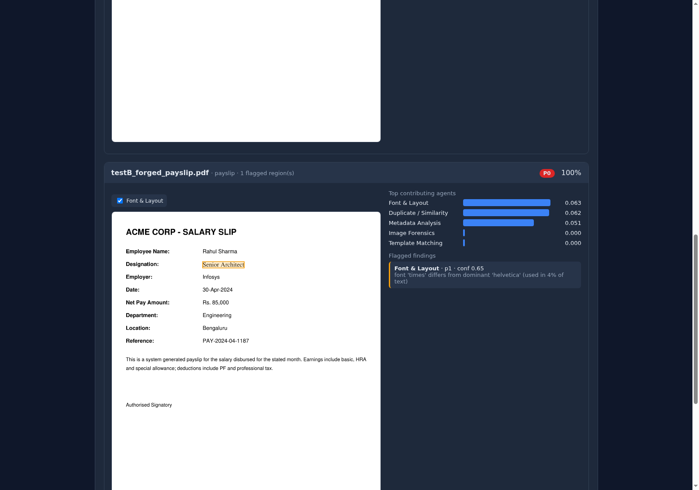

# SETUP — AI Document Forgery Detection POC

A FastAPI service that ingests candidate BGV documents (PDF / DOCX / image),
runs an 8-step multi-agent forensic pipeline (11 specialist agents in parallel),
and returns a structured fraud verdict with suspicious regions highlighted as
bounding-box overlays in an HTML UI.

Every heavy model and external API is **optional**: when a weight download or an
API key is missing, that agent/step degrades gracefully (returns an
`available: false` / `error` stub) and the pipeline continues. Sections 7–8
record exactly what ran and what was skipped during the dry run.

---

## 1. Prerequisites

| Dependency | Version used / tested | Required? |
|------------|----------------------|-----------|
| Python | 3.12 (3.10+ works) | required |
| pip | latest | required |
| Tesseract OCR (`tesseract-ocr`) | 4.1.1 | required (baseline OCR engine) |
| ExifTool (`libimage-exiftool-perl`) | 12.40 | recommended (Agent 1 metadata; PyMuPDF used as fallback) |
| zbar (`libzbar0`) | system | required for `pyzbar` (Agent 8 QR/barcode) |
| OpenGL (`libgl1`) | system | required for OpenCV |
| Poppler (`poppler-utils`) | system | recommended |
| GPU | — | **not required** (CPU-only; heavy DL models optional) |

System packages (Debian/Ubuntu):

```bash
sudo apt-get update && sudo apt-get install -y \
  tesseract-ocr libimage-exiftool-perl libzbar0 libgl1 poppler-utils
```

---

## 2. Installation

```bash
git clone <REPO_URL>
cd forgery_detection_poc

python -m venv .venv && source .venv/bin/activate   # optional but recommended
pip install -r requirements.txt
python -m spacy download en_core_web_sm
```

`requirements.txt` installs only the **required, CPU-only** stack (FastAPI,
PyMuPDF, Pillow, OpenCV-headless, pytesseract, pdfminer.six, imagehash,
datasketch, faiss-cpu, spaCy, symspellpy, pyzbar, scikit-learn, lightgbm, shap,
fpdf2). Optional heavy components are commented at the bottom of the file:

```bash
# Optional — heavy deep-learning models (Step 3 + Agent 2). Large downloads.
pip install torch transformers timm

# Optional — 2nd OCR engine (activates Agent 10). Downloads weights on first use.
pip install paddleocr paddlepaddle

# Optional — external LLM (Step 5) / cloud OCR (Step 2 primary)
pip install openai anthropic azure-ai-documentintelligence
```

---

## 3. Configuration

Copy `.env.example` to `.env` and fill in what you have. **All keys are optional**
— missing keys degrade the matching agent/step gracefully. Thresholds live in
`config.py` and can be overridden via the same env vars.

| Variable | Required? | Controls | How to obtain |
|----------|-----------|----------|---------------|
| `AZURE_DOC_INTELLIGENCE_ENDPOINT` | optional | Step 2 primary (layout-aware) OCR | Azure Portal → create "Document Intelligence" resource → *Keys & Endpoint* |
| `AZURE_DOC_INTELLIGENCE_KEY` | optional | as above | as above |
| `AZURE_OPENAI_ENDPOINT` | optional | **Preferred** Step 5 LLM backend (Azure OpenAI / AI Foundry); resource endpoint `https://<resource>.openai.azure.com/` | Azure AI Foundry / Portal → Azure OpenAI resource → *Keys & Endpoint* |
| `AZURE_OPENAI_API_KEY` | optional | Azure OpenAI key (set with endpoint + deployment to enable) | as above |
| `AZURE_OPENAI_DEPLOYMENT` | optional | Azure OpenAI **deployment name** (the model is addressed by deployment, e.g. `gpt-4o`) | Azure AI Foundry → Deployments |
| `AZURE_OPENAI_API_VERSION` | optional | Azure OpenAI REST API version (default `2024-06-01`) | n/a |
| `OPENAI_API_KEY` | optional | Step 5 fallback LLM (plain OpenAI) | platform.openai.com → API keys |
| `ANTHROPIC_API_KEY` | optional | Step 5 fallback LLM (Anthropic) | console.anthropic.com → API keys |
| `CROSS_DOC_MODEL` | optional | model id for **plain OpenAI / Anthropic only** (`gpt-4-turbo`, `claude-opus-4-6`, …); ignored for Azure OpenAI (uses deployment) | n/a (default `gpt-4-turbo`) |
| `TEMPLATE_SOURCE` | optional | `local` (default) reads `templates/`; `azure_blob` fetches authentic templates from Blob Storage (Agent 4 + Step 3 OOD) | set to `azure_blob` + provide the connection string below |
| `AZURE_BLOB_CONNECTION_STRING` | optional | Blob account used when `TEMPLATE_SOURCE=azure_blob` | Azure Portal → Storage account → *Access keys* → Connection string |
| `AZURE_BLOB_TEMPLATE_CONTAINER` | optional | Blob container holding `<doc_type>/<file>` templates (default `authentic-templates`) | name of your container |
| `ENABLE_PADDLEOCR` | optional | `1` activates 2nd OCR engine → Agent 10 | set after `paddleocr`/`paddlepaddle` installed and weights reachable |
| `RASTER_DPI` | optional | raster DPI; **all bboxes are in px at this DPI** (default 150) | n/a |
| `OOD_THRESHOLD` | optional | Step 3 FAISS out-of-distribution distance (1.5) | n/a |
| `AGENT2_THRESHOLD` | optional | image-forensics tamper-heatmap cutoff (0.4) | n/a |
| `AGENT4_SSIM_THRESHOLD` | optional | template SSIM cutoff (0.7) | n/a |
| `AGENT5_PHASH_THRESHOLD` | optional | near-duplicate pHash Hamming distance (10) | n/a |
| `AGENT9_THRESHOLD` / `AGENT9_NOVELTY_HIGH` | optional | novelty anomaly cutoffs (0.6 / 0.75) | n/a |
| `AGENT10_THRESHOLD` | optional | weighted cross-OCR disagreement cutoff (0.5) | n/a |
| `AGENT11_DELTA_THRESHOLD` | optional | adversarial ELA-delta cutoff (0.2) | n/a |
| `RULE1_UNCERTAINTY_THRESHOLD` | optional | escalation Rule 1 std-dev cutoff (0.25) | n/a |
| `RULE2_DISAGREEMENT_DELTA` / `RULE2_MIN_AGENTS` | optional | escalation Rule 2 (0.4 / 2) | n/a |
| `MAX_FILE_BYTES` | optional | upload size limit (50 MB) | n/a |

---

## 4. First-Run Model Downloads

| Model | Trigger | Approx. size | If unavailable |
|-------|---------|--------------|----------------|
| spaCy `en_core_web_sm` | `python -m spacy download …` (manual) | ~12 MB | Agents 6 & 7 degrade (no NER/date entities) |
| DiT `microsoft/dit-base` (embeddings) | first analysis, **only if** `torch`+`transformers` installed | ~340 MB | Step 3 falls back to a deterministic 768-d feature vector |
| LayoutLMv3 `microsoft/layoutlmv3-base` | first analysis, if installed | ~500 MB | Step 3 field extraction falls back to regex/OCR |
| Donut `naver-clova-ix/donut-base` | first analysis, if installed | ~750 MB | independent extraction path skipped |
| PaddleOCR det/rec/cls weights | first OCR call, **only if** `ENABLE_PADDLEOCR=1` | ~20 MB | engine 2 inactive → Agent 10 inactive |
| TruFor / MVSS-Net / Noiseprint | Agent 2, if weights placed under `models/` | varies (manual) | Agent 2 uses ELA + noise-residual only |
| Agent 9 novelty model | first analysis | trained per-document at runtime (no download) | n/a (always available) |

No GPU is required; all of the above run on CPU (heavy DL models are simply
slower).

---

## 5. Running the Application

```bash
python -m uvicorn main:app --host 0.0.0.0 --port 8000
# then open http://localhost:8000 in a browser
```

Upload 1–5 documents for one candidate, pick a document type per file, and click
**Analyze documents**. Results show an overall P0/P1/P2 verdict banner, per-
document cards, a PDF.js canvas viewer with colored bbox overlays (red > 0.75,
amber 0.4–0.75, yellow < 0.4), per-agent overlay toggles, a cross-document
contradictions table, a SHAP attribution bar chart, and an *Export verdict JSON*
button.

API: `POST /analyze` (multipart: `files`, `candidate_id`, `doc_types`) →
verdict JSON. `GET /raster/{doc_id}/{page}` serves the 150-DPI page raster used
by the canvas overlay. `GET /health` is a liveness probe.

---

## 5a. Operator Tools (manual — not run by the pipeline)

Two standalone scripts ingest an authentic-document corpus to improve detection
once one is available. **Neither runs automatically.** Both accept
`--source local` (reads `templates/`) or `--source azure_blob` (reads the Blob
container from `AZURE_BLOB_CONNECTION_STRING` + `AZURE_BLOB_TEMPLATE_CONTAINER`,
organised as `<container>/<doc_type>/<file>`).

```bash
# Ingest authentic templates into the Step-3 OOD FAISS index (incremental:
# re-running only adds files not already indexed). Improves Agent 4 + Step 3.
python scripts/index_templates.py --source local
python scripts/index_templates.py --source azure_blob

# Re-train Agent 9 (novelty) on the authentic corpus; writes
# models/agent9_weights/patchcore_pca.npz, which Agent 9 auto-loads next run.
python scripts/finetune_agent9.py --source azure_blob
```

Templates and templates/Agent-4 access go through the **TemplateStore**
abstraction (`pipeline/template_store.py`); the Step-3 OOD index is the
persisted **TemplateEmbeddingIndex** (`pipeline/template_embedding_index.py`).
Switching from local to Azure Blob is a **config-only** change
(`TEMPLATE_SOURCE=azure_blob` + connection string) — no code edits.

> **Note on `finetune_agent9.py` with placeholder templates:** the POC ships
> only synthetic placeholder templates, which are *not* representative of real
> documents. Fine-tuning Agent 9 on them makes the global model over-flag
> ordinary documents, so the POC default ships **no** Agent-9 weights and uses
> the per-document fallback detector. Run `finetune_agent9.py` only once a real
> authentic corpus is available.

---

## 6. Running the Dry Run

```bash
python dry_run.py
```

Generates two synthetic payslips and runs the full pipeline:

- **Test Case A** — clean payslip (fpdf2), creation date 2024-05-01.
- **Test Case B** — copy of A with the designation field swapped to a different
  font (Times-Roman 14 vs Helvetica 12), producer set to `iLovePDF`, and
  `modDate` set after the creation date. Then A+B are analysed together as a
  candidate pair to trigger Step 5.

Expected console output (realised on the reference run):

```
===== TEST CASE A (clean, single doc) =====
candidate band: P2  fraud_score: 0.0
  - testA_clean_payslip.pdf  band=P2 score=0.0   agents flagged: none

===== TEST CASE B (clean + forged pair) =====
candidate band: P0  fraud_score: 1.0
  - testA_clean_payslip.pdf  band=P2 score=0.1   agents flagged: none
  - testB_forged_payslip.pdf band=P0 score=1.0   agents flagged: {agent_1: 0.6, agent_3: 0.65, agent_5: 0.85}
  cross-doc [rule_based_fallback]:
    * designation_mismatch ['testA…', 'testB…']: 'software engineer' vs 'senior architect'
```

Verdict JSONs are written to `dry_run_output/`. P2 = low risk (green),
P1 = medium (amber), P0 = high (red).

### UI overlay (dry run, Test Case B)

On the forged payslip the altered **Designation** value ("Senior Architect") is
rendered with an **amber bounding box** (Agent 3, *Font & Layout*, confidence
0.65 → P1-level region) directly over the field in the canvas viewer. Hovering
shows `Font & Layout · conf 0.65 · font 'times' differs from dominant
'helvetica'`. The clean document (Test Case A) renders with **no overlays** and
an empty "Flagged findings: None". Example:



---

## 7. Limitations & Known Gaps (from dry run)

The reference dry run ran CPU-only with **no API keys** and **no heavy DL
packages** installed. Realised behaviour:

| Component | Status on reference run | Reason / how to enable |
|-----------|------------------------|------------------------|
| Agent 1 — Metadata | **active** (flagged forged doc) | PyMuPDF + exiftool |
| Agent 2 — Image Forensics | **partial** — ELA + noise-residual active; TruFor / MVSS-Net / Noiseprint skipped | place weights under `models/`; deep hooks are stubs in the POC |
| Agent 3 — Font & Layout | **active** (flagged the font swap) | pdfminer.six |
| Agent 4 — Template | **active** (placeholder templates auto-seeded) | add real templates under `templates/` to improve SSIM |
| Agent 5 — Duplicate | **active** (flagged near-duplicate) | imagehash + datasketch + faiss |
| Agent 6 — Temporal | **active** | spaCy `en_core_web_sm` |
| Agent 7 — NER / Semantic | **active** | spaCy + symspellpy |
| Agent 8 — QR / Barcode | **active** (none present → no flag) | pyzbar + libzbar0 |
| Agent 9 — Novel Fraud | **active** (per-document PCA autoencoder fallback) | PatchCore/DRAEM not installed; per-doc autoencoder used |
| Agent 10 — Cross-OCR | **inactive** | needs a 2nd OCR engine; Azure key absent and PaddleOCR weight host unreachable (`ENABLE_PADDLEOCR=0`) |
| Agent 11 — Adversarial | **active** (5 perturbations re-run ELA) | — |
| Step 2 OCR | **Tesseract only** | Azure DI key absent; PaddleOCR disabled (see Agent 10) |
| Step 3 LayoutLMv3 / Donut / DiT | **fallback** | `torch`/`transformers`/`timm` not installed → deterministic 768-d embedding + regex/OCR field extraction; FAISS OOD still runs |
| Step 5 Cross-document LLM | **rule-based fallback** | no Azure OpenAI (`AZURE_OPENAI_*`) / `OPENAI_API_KEY` / `ANTHROPIC_API_KEY`; deterministic contradiction rules used (still detected `designation_mismatch`). Backend preference: Azure OpenAI → OpenAI → Anthropic → rule-based |
| Step 6 calibration | **raw weighted score** | isotonic calibration needs >50 labelled examples in `models/labels.json` |

Nothing in the list crashes the pipeline — each is an explicit graceful-
degradation path. To run at full fidelity, install the optional packages
(Section 2), add API keys (Section 3), and drop model weights into `models/`.

---

## 8. Accuracy Notes

Realised detection on the two dry-run cases (CPU-only, no keys, no heavy DL):

| Test case | Expected band | Realised band | Realised fraud score | Outcome |
|-----------|---------------|---------------|----------------------|---------|
| A — clean payslip | P2 | **P2** | 0.0 (single) | correct: no agents flagged, no overlays |
| B — forged payslip | P1 / P0 | **P0** | 1.0 | correct: Agent 1 (0.60), Agent 3 (0.65), Agent 5 (0.85) flagged |
| A within the A+B pair | P2 | **P2** | 0.1 | correct: unaltered copy stays low |

Cross-document reasoning (Step 5) correctly returned **1 contradiction**
(`designation_mismatch`: "software engineer" vs "senior architect") via the
rule-based fallback.

Escalation (Step 7) on the forged document: Rule 1 fired
(`human_review_required = True`, agent-score std ≈ 0.30 > 0.25) and Rule 2 fired
(`disagreement_override = True`). The altered designation field was surfaced as
a flagged bbox region in the UI.

**Caveats.** These rates are on **2 synthetic documents** and are illustrative of
pipeline wiring, not a statistical accuracy claim. Detection of image-level
splicing (TruFor/MVSS-Net), template-logo fraud (real templates), and multi-
engine OCR disagreement (Agent 10) are not exercised here because those optional
components were not provisioned; enable them per Sections 2–4 for a fuller
evaluation.
